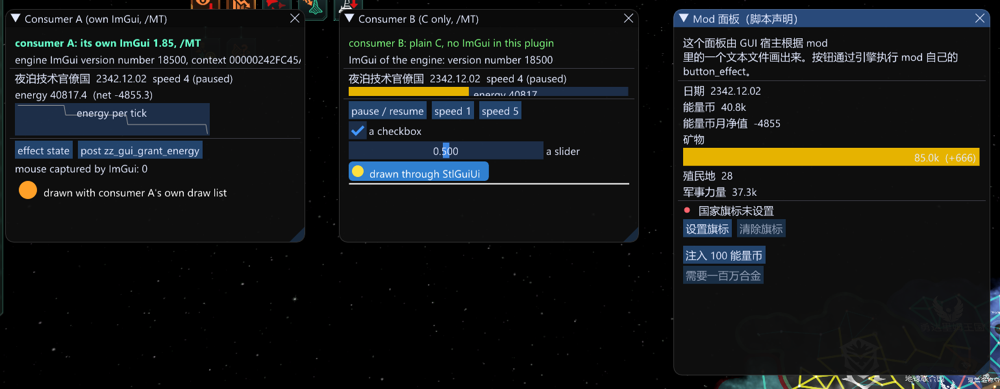

# stellaris-guiexpand

[English](README.md) | [简体中文](README.zh-CN.md)

A shared GUI host for **Stellaris 4.5.2** (Windows x64, the `-dx11` build). It starts the Dear ImGui that is already compiled into `stellaris.exe` and
draws panels inside the game, so that:

- **plugin developers** can show a panel with a small C interface (`include/stellaris_guiexpand/stellaris_gui_api.h`), in C, C++ with or without their own
  ImGui, or any language that can call a C function. They do not hook anything, read no engine memory, and are not rebuilt after a game patch;
- **mod authors** can describe a panel in a text file inside their mod (`interface/stl_gui/*.txt`, the same script syntax the game uses) and have
  it drawn, with localisation, values that the mod's script computes (variables, `scripted_loc`, script values) and buttons that run the mod's own
  `button_effect`s. No DLL, no programming;
- **players** get the panels of everything they installed, in one place, plus an optional reference skin: a status capsule and the *Command Deck*.

It is a plugin of the **Stellaris launcher** (plugin spec v2). It needs no mod and does not touch save files.



*Left to right: a plugin with its own ImGui copy; a plain C plugin with no ImGui at all; a panel declared in a mod's text file.*

| Release file | Contents |
|---|---|
| `stellaris-guiexpand-v<version>.zip` | **the plugin folder itself**: `stl-plugin.json`, `stellaris_guiexpand.dll`, `defaults\stellaris_guiexpand.ini`, this README |
| `stellaris-guiexpand-sdk-v<version>.zip` | the C interface headers, the example plugins and the two guides, for developers of other plugins |

## For whom, and where to read

| You are | Read |
|---|---|
| a player | this page: [Install](#install-and-use), [Settings](#settings) |
| a **plugin developer** | [docs/developers.md](docs/developers.md) and `examples/` |
| a **mod author** | [docs/mod-authors.md](docs/mod-authors.md); a working mod is in the [stellaris-guiexpand-test-mod](https://github.com/Yidhar/stellaris-guiexpand-test-mod) repository |
| curious how it works | [docs/architecture.md](docs/architecture.md) |

## Compatibility

- Works with **one exact game build**: the `stellaris.exe` whose PE timestamp is in the manifest (`game.exe_timestamps`) and in the release notes.
  The launcher does not load the plugin into another build, and the DLL checks it again and hooks nothing on a mismatch. After a game patch the SDK
  subset has to be regenerated and the DLL rebuilt (see [Building](#building)).
- Plugins and mods that use stellaris-guiexpand's interface do **not** depend on the game build: only the host does.
- Engine addresses are not hard-coded: they come from an SDK generated from the installed executable (`sdk/stellaris_sdk.hpp`, a subset written by
  `tools/extract_sdk.py` from the generator in the [Stellaris MCP](https://github.com/Yidhar/stellaris-mcp) repository).
- Single player is the tested case. Declared and plugin buttons run script effects through the engine's own command path (the same
  `CExecuteButtonEffectCommand` the game's buttons use), which is checked by every client; multiplayer has not been tested.

## Install and use

1. Download `stellaris-guiexpand-v<version>.zip` from the [Releases page](https://github.com/Yidhar/stellaris-guiexpand/releases) (the `.sha256` file next to it holds the checksum).
2. Unpack it into `Documents\Paradox Interactive\Stellaris\plugins\stellaris-guiexpand\` (no top folder: `stl-plugin.json` ends up directly in that folder), or
   unpack it anywhere and install the folder with the launcher: `stl plugin install <folder>`.
3. Enable the plugin in your playset (`stl plugin enable stellaris-guiexpand`, or the launcher's Plugins page).
4. **Start the game with the Stellaris launcher** (`stl launch`, or its Play button). The launcher waits for the game window and loads the plugin.
   Starting the game from Steam or the Paradox launcher starts it without plugins.
5. In a game, the status capsule appears at the bottom of the screen. Click its orb or press **Ctrl + Shift + G** to open the Command Deck.

Panels of other plugins and of mods appear as windows on the left of the screen. They can be moved and closed with the usual ImGui controls.

## Settings

`config\stellaris_guiexpand.ini` in the plugin folder (the launcher seeds it from `defaults\stellaris_guiexpand.ini` and shows it for editing; restart the game to apply):

| Key | Default | Meaning |
|---|---|---|
| `deck` | 1 | the reference skin (capsule and Command Deck). `0` = host only: panels of plugins and mods are still drawn |
| `deck_open` | 0 | open the deck window at start |
| `theme` | 0 | 0 aurora, 1 ember, 2 verdant, 3 crimson |
| `stars` | 1 | stars in the deck's background |
| `extra_mod_dirs` | | folders (separated by `;`) scanned for declared panels besides the mods of the active playset: for developing a mod without enabling it |
| `dev_commands` | 0 | development: the host runs the lines of `logs\stellaris_guiexpand.cmd` (used by `tools/live/guiexpand_test.py`) |
| `dev_unload` | 0 | development: unload by an event, so a new build can be tried without restarting. A released plugin must not unload itself |

The log is `logs\stellaris_guiexpand.log` in the plugin folder. Nothing is written to the game folder.

## What is in the box

```
include/stellaris_guiexpand/    the public interface: stellaris_gui_api.h (C), stellaris_gui_client.h (find the host), stellaris_gui_imgui.hpp (own-ImGui binding)
examples/          cpp_imgui: a plugin with its own ImGui;  c: a plain C plugin
src/               the host (core, host_api, decl_panels, deck, imgui_host, loc, dllmain)
sdk/               stellaris_sdk.hpp: generated subset (RVAs and offsets for the exe build named in it)
plugin/            stl-plugin.json and defaults\stellaris_guiexpand.ini
tools/             build.bat, check_plugin.py, extract_sdk.py, gen_ui_glyphs.py, live/guiexpand_test.py
docs/              developers.md, mod-authors.md, architecture.md
```

## Building

Visual Studio 2022 (x64) and CMake 3.20. MinHook and Dear ImGui 1.85 are fetched by CMake.

```
tools\build.bat [path\to\vcvars64.bat]     # -> build\plugin\stellaris-guiexpand  (install it with: stl plugin install --link build\plugin\stellaris-guiexpand)
python tools\check_plugin.py --dir build\plugin\stellaris-guiexpand
```

After a game patch: run `tools/sdk_dumper/dump.py` in the Stellaris MCP repository, then
`python tools/extract_sdk.py <that repository>\stellaris_bridge\include\sdk\stellaris_sdk.hpp`, rebuild. The `static_assert`s in `src/imgui_host.cpp` stop
the build if the engine's ImGui no longer has the layout this DLL is built against.

`python tools/gen_ui_glyphs.py` regenerates `src/ui_glyphs.inc` (the characters of the UI strings, which the font atlas needs because the engine builds it
once and cannot add glyphs later). CI fails when it is stale.

### Testing

There is no unit-test framework: the host runs inside the game. `tools/live/guiexpand_test.py` stages the plugin folders, injects the host and the example
plugins into a running game (it uses the bench scripts of the stellaris-perf repository and the launcher's `stl inject`; see its header for the paths) and
drives the host's development commands. The test mod in the stellaris-guiexpand-test-mod repository provides the button effects and a declared panel.

## License

MIT, see `LICENSE`. Dear ImGui (MIT) and MinHook (BSD-2-Clause) are fetched at build time and linked statically.
