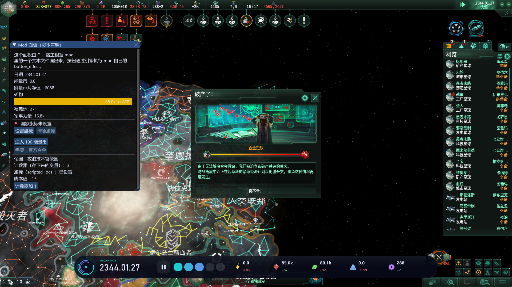

# Adding a panel to your mod

For **mod authors**: no DLL and no programming. You write a text file in the script syntax the game already uses, inside your mod, and stellaris-guiexpand draws it as a
window in the game. The player needs the stellaris-guiexpand plugin installed; without it your file is ignored (the game never looks into this folder).

A complete working mod is in the [stellaris-guiexpand-test-mod](https://github.com/Yidhar/stellaris-guiexpand-test-mod) repository: copy its layout.

```
my_mod/
  descriptor.mod
  common/button_effects/my_mod.txt          the actions your buttons run (normal game script)
  interface/stl_gui/my_mod_panels.txt       the panel declaration (this guide)
  localisation/english/my_mod_l_english.yml  the texts
```

## Why `interface/stl_gui/`

The engine does not read that folder (measured: no line in `error.log`, `game.log`, `setup.log` or `debug.log`), and `interface/` is not part of the multiplayer
checksum: players may have different UIs without an out-of-sync. Your **actions** stay in `common/button_effects`, which is checked, so every client runs the same
script and the engine rechecks `potential` / `allow` on each of them.

## The file

Paradox script: `key = value`, `key = { ... }`, `#` comments, quoted strings; a key may repeat in a block (several `button`s) and the order is kept.

```
stl_gui_version = 1                      # required. A file without it, or with another value, is ignored (and logged)

panel = {
    id    = overview                     # unique in your mod. In the host it is "<mod name>:<id>"
    title = MYMOD_TITLE                  # a localisation key; a text with a space in it is shown as written
    size  = { 380 440 }                  # optional: the size when first opened (the player may resize and move it)

    content = {
        text      = { text = MYMOD_INTRO }
        separator = yes
        spacer    = 6                                                    # pixels
        date      = { label = MYMOD_DATE }
        value     = { label = MYMOD_ENERGY  resource = energy  show = stock }   # stock | net | income | expense | max
        gauge     = { label = MYMOD_MINERALS  resource = minerals }              # stock against the cap, as a bar
        stat      = { label = MYMOD_COLONIES  stat = colonies }                  # colonies pops empire_size military_power tech_power economy_power
        badge     = { probe = my_probe_effect  yes = MYMOD_ON  no = MYMOD_OFF }  # a button_effect asked as a yes/no question
        row = {                                                          # side by side
            button = { text = MYMOD_SET    effect = my_set_effect }
            button = { text = MYMOD_CLEAR  effect = my_clear_effect }
        }
        button    = { text = MYMOD_GRANT  effect = my_grant_effect }
    }
}
```

A file can hold several `panel`s and your mod several files. Two panels with the same id in one mod: the first is kept, the second is rejected and logged.

### Elements

| Element | Shows | Fields |
|---|---|---|
| `text` | a paragraph | `text` (loc key) |
| `separator` | a line | `yes` |
| `spacer` | vertical space | the number of pixels |
| `date` | the game date | `label` |
| `value` | one number of a resource | `label`, `resource` (key as in `common/strategic_resources`, e.g. `energy`), `show` = `stock` (default), `net` (per month), `income`, `expense`, `max` |
| `gauge` | stock against cap | `label`, `resource` |
| `stat` | a country figure | `label`, `stat` = `colonies`, `pops`, `empire_size`, `military_power`, `tech_power`, `economy_power` |
| `badge` | a coloured yes/no | `probe` (a button effect), `yes` / `no` (loc keys) |
| `button` | a button that runs an effect | `text` (loc key), `effect` (a key of your `common/button_effects`) |
| `row` | puts its `button`s side by side | the elements |

The numbers are those of the **player's country**, taken between turn ticks.

### Buttons and the engine's own checks

A `button`'s `effect` is the name of an entry in your `common/button_effects`. The button is enabled only while the **engine** says the effect may run: it evaluates
`potential` and `allow` itself, and when it refuses, the button is greyed and the engine's own reason text is the tooltip. Pressing it runs the effect through the
game's own command path for the player country (`This` and `From` are the player country), exactly like a button in the game's own windows.

```
# common/button_effects/my_mod.txt
my_set_effect = {
    potential = { always = yes }
    allow     = { NOT = { has_country_flag = my_flag } }
    effect    = { set_country_flag = my_flag }
}
```

### Showing anything a trigger can test: the `badge` trick

`badge` does not read variables or flags. It asks the engine whether a `button_effect` is currently allowed, and shows `yes` or `no`. So to show *"the flag is set"*,
declare an effect whose `allow` is the condition you want and whose `effect` is empty, and point the badge at it:

```
my_flag_is_set = { potential = { always = yes }  allow = { has_country_flag = my_flag }  effect = { } }
```
```
badge = { probe = my_flag_is_set  yes = MYMOD_FLAG_ON  no = MYMOD_FLAG_OFF }
```

Any trigger works this way (flags, technologies, ethics, resource amounts, event targets...).

## Showing values the script computes

Every text of a declared panel (`text`, every `label`, button texts, the two sentences of a `badge`) is a localisation key, and a localisation text may contain the
game's own `[...]` commands. stellaris-guiexpand has the engine evaluate them, for **the player's country** (`This`, `From` and `Root` all mean the player's country), so a panel
can show what your script computes:



| In the `.yml` | Shows |
|---|---|
| `"Empire: [Root.GetName]"` | the country's name (and the other text commands the game knows for a country) |
| `"Counter: [Root.my_counter]"` | a **stored variable** of the country; empty until your script has set it |
| `"[Root.MyFlagText]"` | a **scripted_loc**: `defined_text = { name = MyFlagText ... }` of `common/scripted_loc`, the text chosen by triggers |
| `"Value: [Root.MyValue]"` | a **script value**, through a scripted_loc: `defined_text = { name = MyValue  value = value:my_script_value }` |

This is the test mod's panel (`stellaris-guiexpand-test-mod`), all four lines tested in the game:

```
# common/script_values/guiexpand_test.txt
guiexpand_test_value = { base = 10  modifier = { add = 5  has_country_flag = guiexpand_test_marked } }

# common/scripted_loc/guiexpand_test.txt
defined_text = { name = GuiexpandTestValue  value = value:guiexpand_test_value }
defined_text = {
    name = GuiexpandTestFlag
    text = { trigger = { has_country_flag = guiexpand_test_marked }  localization_key = guiexpand_test_flag_on }
    default = guiexpand_test_flag_off
}

# localisation/english/guiexpand_test_l_english.yml
 GUIEXPAND_TEST_SC_COUNTER:0 "Counter (a stored variable): [Root.guiexpand_test_counter]"
 GUIEXPAND_TEST_SC_FLAG:0 "Flag (a scripted_loc): [Root.GuiexpandTestFlag]"
 GUIEXPAND_TEST_SC_VALUE:0 "Script value: [Root.GuiexpandTestValue]"
```

Things to know:

- The value is taken **between turn ticks** and again whenever the game state has changed, so it follows your script (a button effect that changes a variable shows up within a moment, also in a paused game).
- You get **text**, not numbers: use the formatting you want in the `.yml` or in the `scripted_loc`.
- Only the player's country is the scope. The selected planet or fleet is not available yet.
- A key whose text contains no `[` costs nothing extra. Evaluating one costs about a microsecond.
- It is the engine's own text processor, so everything the game's localisation does with a country scope works here, and what it does not, does not. How the engine reacts to a **mistake** in a command (`[Root.nonsense]`) has not been tested.

## Localisation

Titles, texts and labels are keys of your `localisation/<language>/*.yml`, looked up by the game's own localisation, so the language setting is followed and your
translations work like those of any mod. Remember the engine's rule that localisation files are **UTF-8 with BOM**.

A value that contains a space, or a key the game does not know, is shown as written.

**Known limitation: characters.** The engine builds its font atlas once, when the ImGui starts, and cannot add glyphs later. stellaris-guiexpand's atlas has the common Chinese
characters, Latin and the characters of its own UI; a rare character in your texts may show as `?`. A fix (scanning enabled mods' localisation for the characters before
the atlas is built) is planned.

## What happens when something is wrong

File-level mistakes are written to stellaris-guiexpand's log (`logs\stellaris_guiexpand.log` in the plugin folder), not shown in the game:

| Mistake | Result |
|---|---|
| a syntax error (unbalanced braces...) | the whole file is ignored; the log names the file |
| no `stl_gui_version = 1` | the file is ignored; logged |
| a panel without `id`, or a second panel with an id already used in the mod | that panel is ignored; logged |
| an unknown element or key | skipped **silently**, so an older stellaris-guiexpand can read part of a newer file; check your spelling |
| an unknown `effect` (button) | the button is shown disabled |
| an unknown `stat` or `resource` | the value is shown as `?` |

Outside a running game, a declared panel shows *not in a game*.

While you work, `config\stellaris_guiexpand.ini` has `extra_mod_dirs` (folders scanned besides the active playset's mods), and with `dev_commands=1` a `scan` line in `logs\stellaris_guiexpand.cmd`
re-reads all declaration files without restarting the game. Windows keep their position and state across a rescan.

The `tools/check_mod.py` of the test mod checks the things a typo breaks silently: every loc key used exists in every language, every effect named exists.

## Multiplayer

Declaration files are not part of the checksum, so each player's UI is independent. Actions are the game's own commands, checked by every client. Not tested in a
multiplayer session yet.
